# Partner Portal — Lead-Management & Telecalling CRM

A lean, focused portal for a real-estate partner/agent team to work a lead list end to end — upload contacts, call through them, qualify, book site visits, and keep the follow-ups honest.

> 🔒 **This is a public showcase.** The source lives in a **private** repository — happy to share with serious reviewers on request. Screenshots use **demo data**; staff accounts and credentials are placeholders.

---

## What it does

Built to be light and fast — the kind of tool a small team actually keeps open all day:

- **Contacts → leads** — upload a contact list (from the main CRM or a spreadsheet) and work it as a live pipeline.
- **Telecalling** — log call attempts and outcomes (interested / callback / not-picked / wrong-number), notes, and attempt counts, with a "stale after N days" nudge.
- **Qualification & stages** — move leads New → Contacted → Qualified → Visit Scheduled → Visited → Closed / Lost, with disqualify and revive paths.
- **Site visits & meetings** — schedule visits and meetings, track status, and keep a field calendar.
- **Follow-ups** — everything due, in one queue.
- **WhatsApp templates** — ready-to-send message templates for common replies.
- **Monitor & activity** — an admin board over the team's calling activity, plus per-agent activity and role-based access.

---

## 📸 Screenshots

**Leads** — the pipeline: filters, stages, call outcomes, budgets
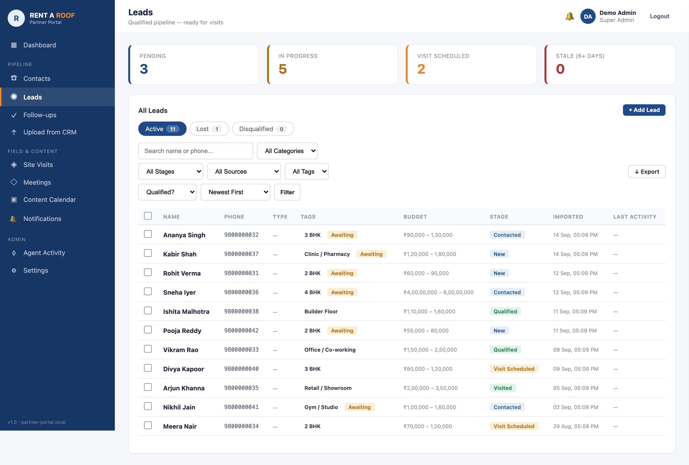

**Dashboard** — contacts to call, active leads, visits, source breakdown
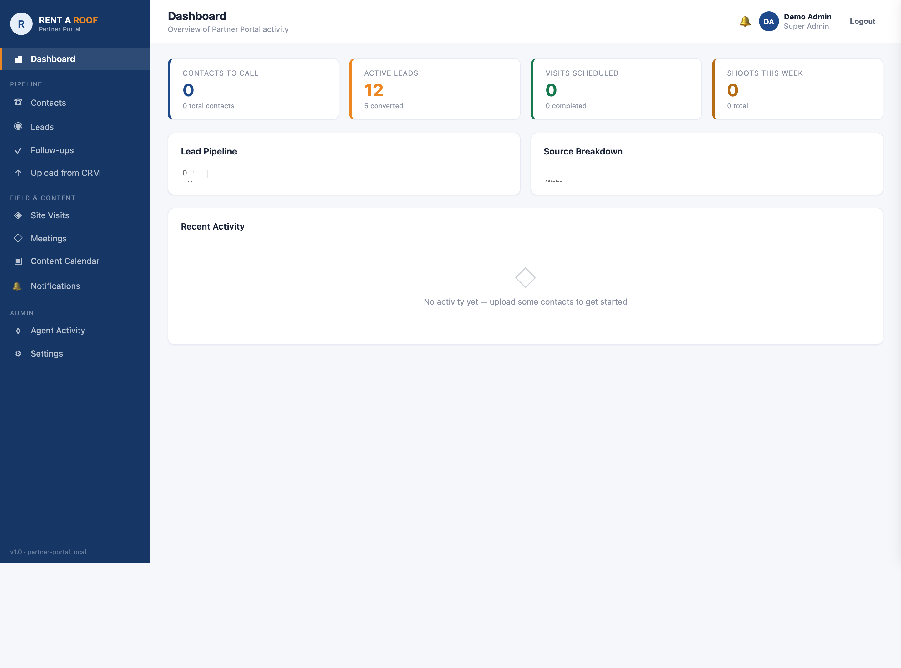

**Contacts** 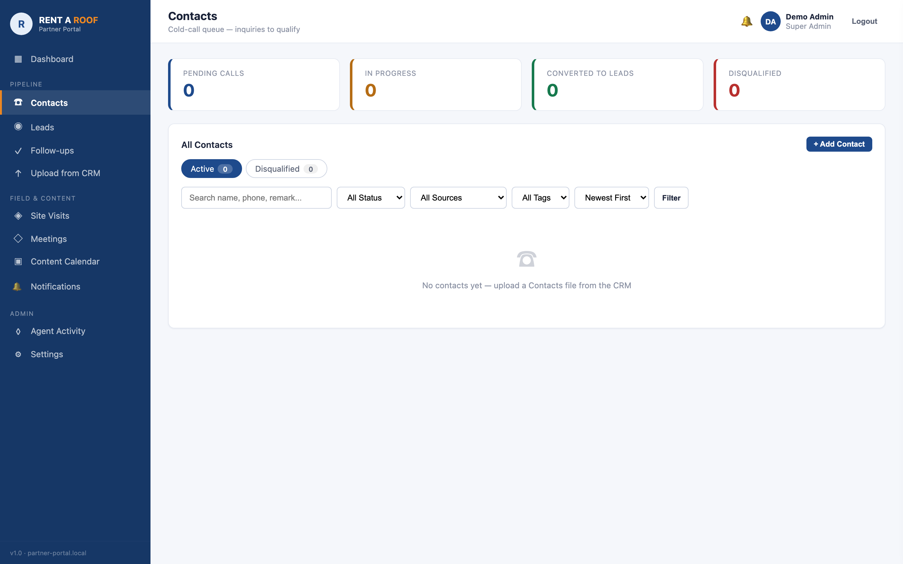
**Follow-ups** 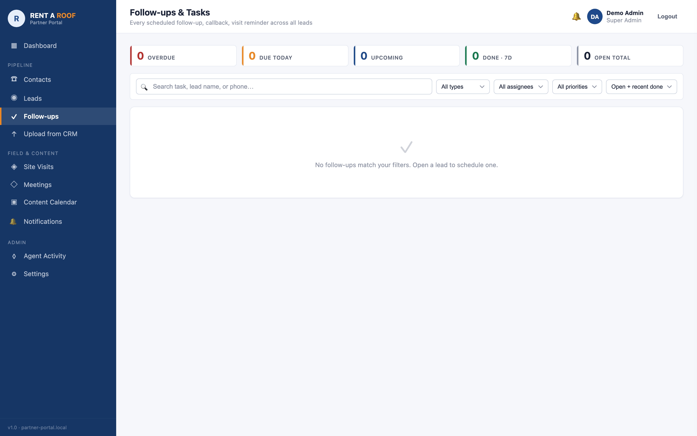
**Meetings** 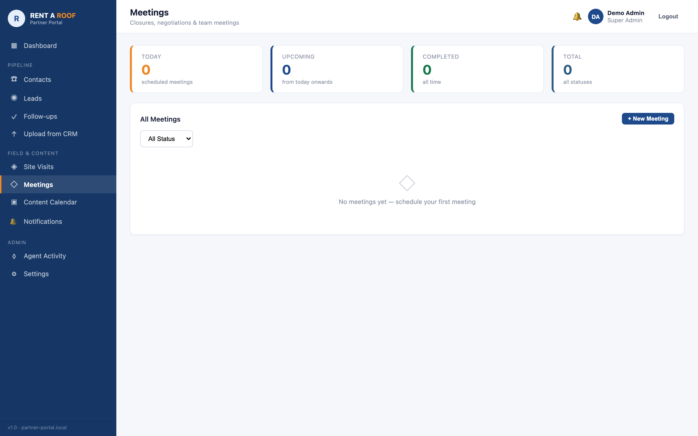
**Monitor** — admin view over calling activity 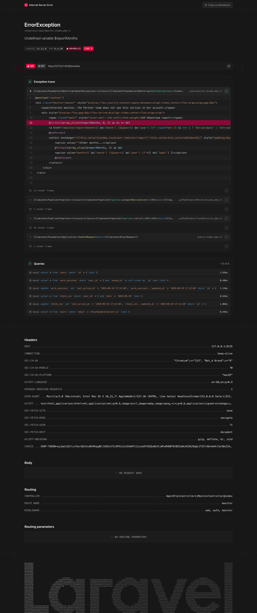

### 📱 Mobile
| Dashboard | Leads | Contacts |
|---|---|---|
| 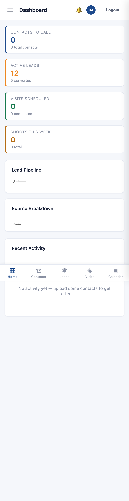 | 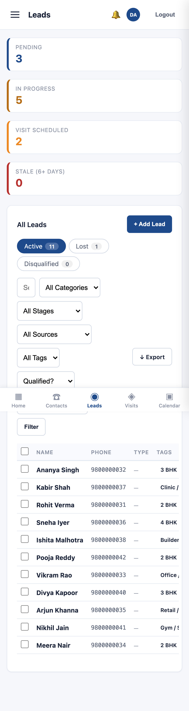 | 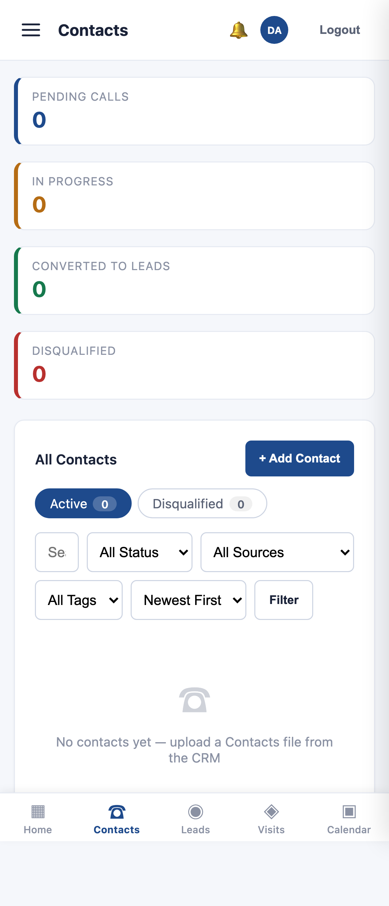 |

| Follow-ups | Meetings | Monitor |
|---|---|---|
| 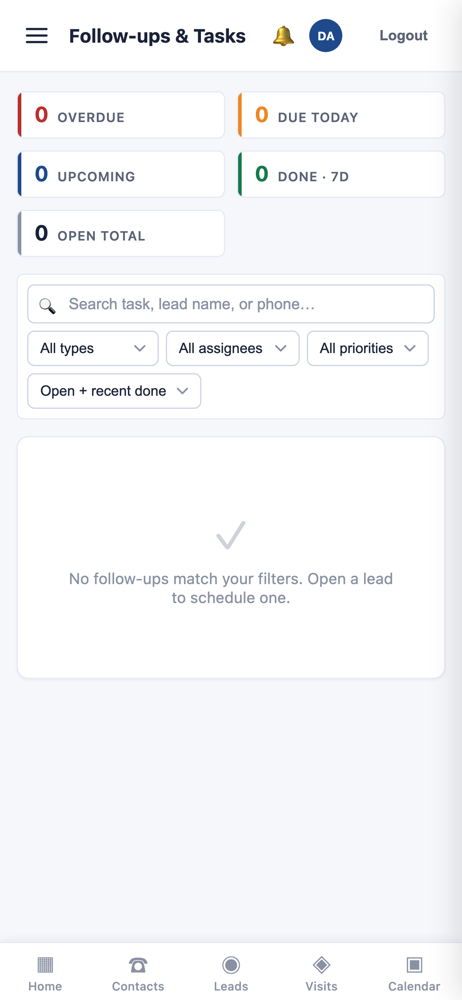 | 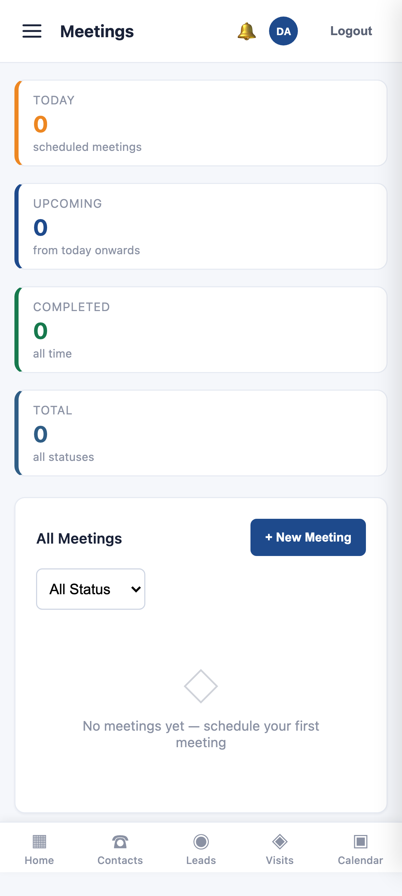 | 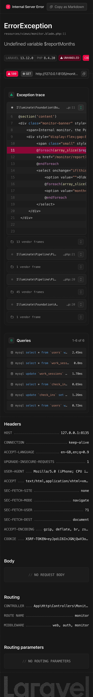 |

---

## 🧰 Tech
`Laravel 13` · `Blade` · `Alpine.js` · `Tailwind CSS` · `MySQL` · `PHP 8.4` · custom auth · role-based access

## 🔑 Want to see the code?
The complete source is in a **private repository** — reach out for access.

---
Built by **[@abBytes-sudo](https://github.com/abBytes-sudo)** · abhimasih0505@gmail.com · +91 73039 37702
